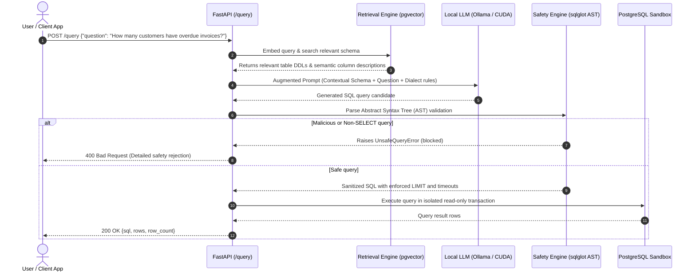

# Production-Grade Text-to-SQL Assistant with Schema RAG & AST Safety Guardrails

[](https://python.org)
[](https://fastapi.tiangolo.com)
[](https://github.com/pgvector/pgvector)
[](https://github.com/tobymao/sqlglot)
[](tests/test_safety.py)
[](LICENSE)

> **[🇪🇸 Leer versión en Español](README.es.md)**

An end-to-end AI system that converts natural language business queries into secure, syntactically verified, and performant SQL queries. 

Designed and built to bridge **5+ years of production experience in enterprise relational databases (Oracle PL/SQL, SQL Server)** with modern **AI Engineering (LLMs, RAG, and Agentic workflows)**.

---

## 🏗️ Architecture Flow



---

## 🎯 Why This Project Matters

One of the greatest challenges in deploying generative AI in enterprise environments is connecting LLMs to structured corporate databases without risking:
1. **Schema Hallucinations:** Asking the LLM to write queries against a 50+ table schema often causes it to invent non-existent column names or faulty join conditions.
2. **Security Vulnerabilities:** Naive regex filters fail against obfuscated SQL injections, multi-statement payloads (`SELECT ...; DROP TABLE`), or comments disguised as DDL.
3. **Runaway Queries:** Slow full-table scans that exhaust production memory and database connection pools.

This project delivers a production-pattern solution:
- **Schema-Pruned RAG:** Embeds database entities (tables, columns, business definitions) into `pgvector`. Only the top relevant schema slice is dynamically injected into the prompt.
- **Zero-Regex AST Validation (`sqlglot`):** Inspects the query's Abstract Syntax Tree to mathematically guarantee that **only single `SELECT` statements** are ever executed.
- **Privacy-First Local Inference:** Fully runnable via **Ollama (GPU CUDA-accelerated)**, ensuring sensitive company schema details never leave on-premise infrastructure.

---

## 🛡️ AST-Level Safety Guardrails (The Core Engine)

Rather than fragile regex pattern matching, [`app/core/safety.py`](app/core/safety.py) uses `sqlglot` to parse and validate incoming SQL:

* **Strict Single Statement Check:** Rejects multiple semicolons and stacked statements (e.g., `SELECT 1; DROP TABLE users;`).
* **Root Expression Verification:** Confirms the root node is strictly `exp.Select`. Any `INSERT`, `UPDATE`, `DELETE`, `DROP`, `ALTER`, or `TRUNCATE` operations trigger an immediate `UnsafeQueryError`.
* **Row-Count Clamping:** Inspects the AST for existing `LIMIT` clauses:
  - If omitted, injects a default `LIMIT 100`.
  - If present but exceeds safety thresholds, clamps it to the maximum allowable limit.
* **Engine-Level Timeouts:** Automatically sets `statement_timeout = 5000` (5s) per session to eliminate unindexed full-table runaway queries.

---

## 🧪 Test Suite

Unit tests cover critical security edge cases, ensuring injection bypasses are caught before hitting the database:

```bash
# Run tests inside the virtual environment
pytest tests/test_safety.py -v
```

```text
tests/test_safety.py::test_valid_select_is_safe PASSED                [ 12%]
tests/test_safety.py::test_drop_table_is_rejected PASSED             [ 25%]
tests/test_safety.py::test_delete_is_rejected PASSED                 [ 37%]
tests/test_safety.py::test_select_with_subquery_insert_is_rejected PASSED [ 50%]
tests/test_safety.py::test_update_disguised_as_comment_is_rejected PASSED [ 62%]
tests/test_safety.py::test_enforce_limit_adds_limit_when_missing PASSED   [ 75%]
tests/test_safety.py::test_enforce_limit_keeps_limit_below_max PASSED     [ 87%]
tests/test_safety.py::test_enforce_limit_caps_limit_above_max PASSED      [100%]

============================== 8 passed in 1.10s ===============================
```

---

## 🚀 Quickstart

### Prerequisites
- Python 3.10+
- Docker (for PostgreSQL with `pgvector`)
- Ollama running locally (or any OpenAI-compatible endpoint)

### 1. Clone & Setup Environment
```bash
git clone https://github.com/andresaragon/text-to-sql-rag.git
cd text-to-sql-rag

python3 -m venv venv
source venv/bin/activate  # On Windows: venv\Scripts\activate
pip install -r requirements.txt
```

### 2. Launch PostgreSQL with pgvector
```bash
docker run --name pg-vector \
  -e POSTGRES_PASSWORD=postgres \
  -p 5432:5432 \
  -d ankane/pgvector
```

### 3. Initialize Database & Seed Sample Data
```bash
psql -h localhost -U postgres -f db/schema.sql
psql -h localhost -U postgres -f db/seed.sql
```

### 4. Index Schema into pgvector
```bash
python scripts/index_schema.py
```

### 5. Launch FastAPI Backend
```bash
uvicorn app.main:app --reload --port 8000
```

---

## 📡 API Usage

### `POST /query`
Translates a natural language question into safe SQL and executes it:

```bash
curl -X POST "http://localhost:8000/query" \
     -H "Content-Type: application/json" \
     -d '{"question": "Which customers have overdue invoices older than 30 days?"}'
```

**Response (200 OK):**
```json
{
  "sql": "SELECT COUNT(DISTINCT customer_id) FROM invoices WHERE due_date < NOW() - INTERVAL '30 days' AND status = 'overdue' LIMIT 100;",
  "rows": [
    {
      "count": 4
    }
  ],
  "row_count": 1
}
```

---

## 📈 Production Scaling Blueprint (Insights from 5+ Years in DBs)

Full technical deliberations and trade-offs are documented in [`NOTES.md`](./NOTES.md). When transitioning this architecture to 100+ table schemas:

1. **Foreign Key Graph Retrieval (Structural + Semantic Hybrid):**
   Pure semantic similarity fails when queries require multi-hop joins across tables with unrelated names. A production RAG system must query `information_schema.key_column_usage` to traverse the foreign-key graph and inject the explicit join path (`invoices.customer_id → customers.customer_id`) into the prompt.
2. **`EXPLAIN ANALYZE` Cost Validation:**
   LLMs generate plausible text, not optimal execution plans. Integrating an automated `EXPLAIN (FORMAT JSON)` pre-flight step allows rejecting queries whose estimated cost exceeds a strict budget before actual execution.
3. **FK Index Enforcement:**
   PostgreSQL does not automatically index foreign keys. Automated schema audits ensure indexes exist on joined columns to prevent table locks and slow joins under LLM load.

---

## 👤 Author

**Santiago Andrés Aragón Guzmán**  
*Senior Backend Engineer (Oracle PL/SQL, SQL Server) transitioning to AI Engineering.*  

- 💼 **LinkedIn:** [linkedin.com/in/santiagoaragonguzman](https://www.linkedin.com/in/santiagoaragonguzman)  
- 🐙 **GitHub:** [@andresaragon](https://github.com/andresaragon)  
- 📧 **Email:** [santiagoaragon.sistemas@gmail.com](mailto:santiagoaragon.sistemas@gmail.com)
